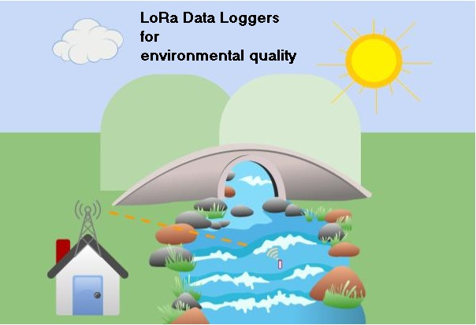
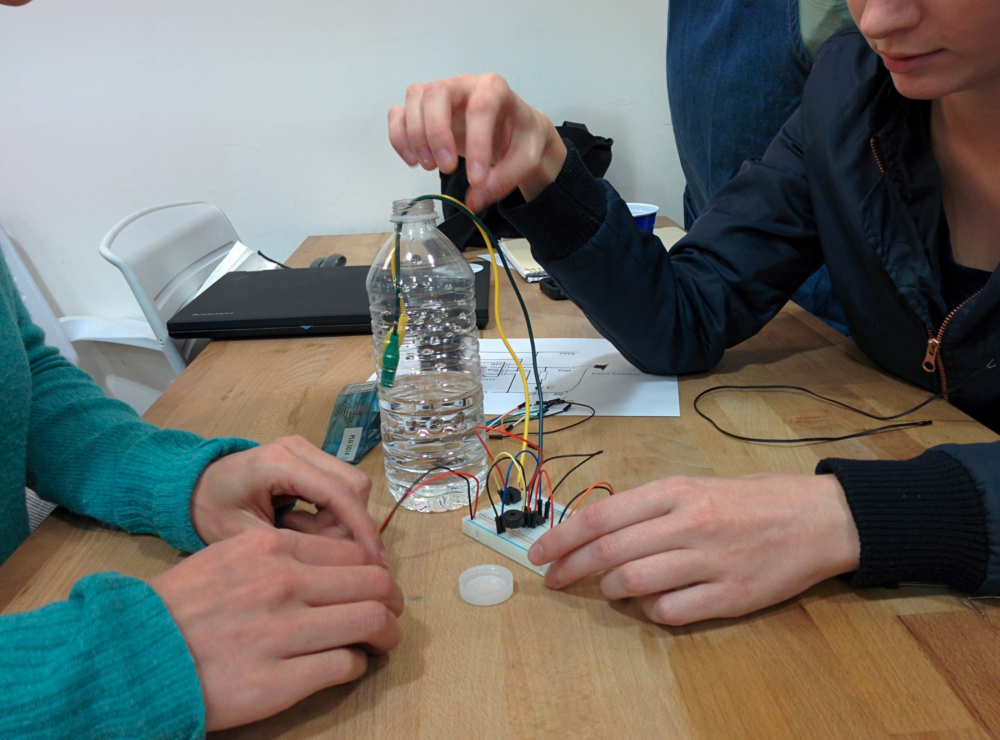
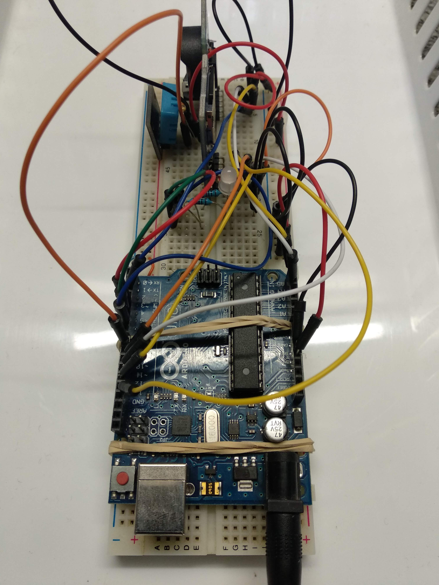
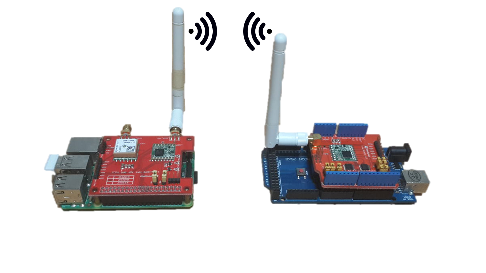

# EcoSen - Registradores de datos abiertos (o lo más abiertos posibles) para variables ambientales (English below)
El monitoreo ambiental es esencial para el cuidado del ambiente. Particularmente, me interesa poder monitorear ambientes acuáticos. Para medir estas variables una opción son los registradoresd e datos privativos. Estos debido a sus altos costos, o por ser de diseños cerrados nos imposibilitan compararlo o repararlos.
Nuestra propuesta consiste en el diseño y desarrollo de registradores de datos (RD) con tecnologías inalámbricas para tener información en tiempo real en cualquier dispositivo conectado a internet. Los RD pueden ser tanto acuáticos como terrestres. Los acuáticos se espera puedan medir información relevante para el cálculo de índices de calidad de agua ([Pesce y Wunderlin, 2000](https://www.sciencedirect.com/science/article/pii/S0043135400000361)), como ser turbidez, oxígeno disuelto, conductividad y pH. El terrestre va a medir aquellas variables relevantes para la calidad del aire o suelo. 
La base técnica para la construcción de estos registradores es la presente en el increíble proyecto [Cave Pearl Proyect](https://thecavepearlproject.org/), pero adaptandolo a aguas superficiales.

### Descargo de responsabilidad
Este proyecto se encuentra en gestación por lo que vamos a ver es su evolución. Aún no hemos logrado un perfecto funcionamiento de lo propuesto ni con todo tipo de sensores ni con la conectividad inalámbrica, así que cualquier persona que se quiera sumar es bienvenida. Puedes comuncarte con alejo.bonifacio@unc.edu.ar

## Motivación
Queremos traer a la sociedad la pasión por el monitoreo de ríos, lagunas, lagos y todo tipo de humedales. Además, reconocemos la importacia de aprender acerca de proyectos de electronica abierta con la posibilidad de reproducir, modificar y personalizar los RD. La tecnología abierta que queremos compartir es asociada a repositorios que harán de la información accesible a cualquier persona. Si en algún momento crees que alguna información no es lo suficiente pública por favor nos lo haces saber.

## Primeros pasos, Midamos algo..
Vamos a usar una placa arduino para registrar unos valores del ambiente. Con esto vamos a lograr ver que estos microcontroladores son capaces de sensar variables ambientales y eso no interesa mucho.

### Materiales (con links a proveedores en Argentina)
* [Arduino uno](https://articulo.mercadolibre.com.ar/MLA-719198757-arduino-uno-r3-con-cable-usb-y-chip-desmontable-atmel-_JM#position=9&search_layout=grid&type=item&tracking_id=e573198c-48a2-4803-9afd-36106603708a)
* [DHT 11](https://articulo.mercadolibre.com.ar/MLA-752254138-modulo-sensor-humedad-relativa-y-temperatura-dht11-arduino-_JM#position=2&search_layout=stack&type=item&tracking_id=45f07ec5-ad22-412b-94d2-94497e139acf)
* [Cables dupont](https://articulo.mercadolibre.com.ar/MLA-621254141-pack-40-cables-macho-macho-10cm-dupont-arduino-y-protoboard-_JM#position=3&search_layout=stack&type=item&tracking_id=f217ef53-0080-491f-b6bd-d42105134adf)
* [Protoboard](https://articulo.mercadolibre.com.ar/MLA-630797518-protoboard-830-puntos-placa-experimental-arduino-electronica-_JM#position=1&search_layout=grid&type=item&tracking_id=1832eed4-aa24-40df-b3ca-a32b95b5c628)
* Cable USB-b a USB-c (viene incluido con el arduino UNO)
* Computadora de escritorio o laptop

### Procedimiento
* Instalamos Arduino IDE en nuestra pc -> [link](https://www.arduino.cc/en/software). Abrimos el software.
* Conectamos la placa a la pc, nos fijamos que puerto se nos habilita en el menú Herramientas/Puerto y lo seleccionamos. Abrimos el ejemplo blink, que se ubica en Archivo/Ejemplo/01.Basics. Subimos el código con la flecha a la derecha en la parte superior de la consola. Por último, vemos de cambiar el tiempo en el que se mantiene prendido y/o apagado el LED cambiando el número que hay dentro de cada uno de los delay que hay en el código. El primero lo cambiamos a 500 y el segundo a 2000. Volvemos a subir el código y chequeamos que la luz se mantenga apagada menos tiempo que prendida.
* Esto no es un paso sino una advertencia. Lo que sigue es empezar a probar códigos que usan librerías. Acá la cosa puede empezar a ponerse algo frustrante. Esto es porque puede haber muchas bibliotecas para un mismo módulo pero no todas funcionan de la misma manera. Entonces vamos a tener que estar muy segures de que la biblioteca sea la que funciona con nuestro código. Para evitar problemas voy a dejar los enlaces para descargar las bibliotecas necesarias para los códigos que vamos a usar.
* Armamos el circuito y probamos el siguiente [código](https://drive.google.com/drive/folders/1apZFteFHHeEfqCXaeWlCMYO2od5rfOG3?usp=sharing). Agregamos la librería DHT sensor library y Adafruit sensor master. Para incluir estas librerías tenemos que descargar los archivos ZIP de cada una de estas ([DHT](https://github.com/adafruit/DHT-sensor-library) y [Adafruit](https://github.com/adafruit/Adafruit_Sensor)). Ahora vamos a Programa/Incluir librería/Añadir biblioteca .ZIP. Ahí cargamos las bibliotecas recientemente descargadas sin descomprimir. Luego de esto vamos a Programa/Incluir biblioteca/ y buscamos DHT y Adafruit, ambas al fondo de la lista desplegable. Una vez realizado esto cargamos el código en la placa y abrimos el monitor serial para ver los valores de humedad y temperatura. 

## Segundo paso, Registremos...
Para empezar a registrar vamos a necesitar un nuevo elemento, el módulo SD. Con este módulo empezaremos a ganar independencia, ya que podremos guardar la información generada por el sensor en una memoria extraíble. Así podremos retirar la información de la placa para leerla en otro dispositivo.

### Materiales, a muchos ya los tenemos :sunglasses:
* Los mismos de antes
* [Módulo micro SD](https://articulo.mercadolibre.com.ar/MLA-905429694-modulo-lector-memorias-micro-sd-arduino-5v-hobbytronica-_JM#position=3&search_layout=grid&type=item&tracking_id=78f54e44-642d-4fc8-b9fd-e26b2e29e181)
* [Memoria micro SD](https://articulo.mercadolibre.com.ar/MLA-927190694-memoria-micro-sd-2gb-nuevas-sin-blister-originales-100-_JM#position=4&search_layout=stack&type=item&tracking_id=d6d6c54d-7f15-4b18-b0df-8bed206f4609)

### Procedimiento
Lo primero que vamos a hacer es ver si el módulo esta funcionando. Para esto vamos a correr [este código](https://drive.google.com/drive/folders/1Auk2bpi2UsZg1wRcR5S4bSVcaOQSAcNh?usp=sharing) de prueba del módulo y si lee una tarjeta. Este código fue creado por Limor Fried y modificado por Tom Igoe. 

El esquema de conexión va a ser el siguiente:
* MOSI -> pin 11 on Arduino Uno/Duemilanove/Diecimila
* MISO -> pin 12 on Arduino Uno/Duemilanove/Diecimila
* CLK -> pin 13 on Arduino Uno/Duemilanove/Diecimila
* CS -> pin 10  

El código cargado necesita de las librerías SD y SPI, pero estas ya vienen instaladas por defecto con el Arduino IDE.

## Tercer paso, agregando información temporal :clock930:
Ahora necesitamos tener una marca temporal para cada una de las mediciones que hagamos. Si bien cuando medimos conectados a una computadora tenemos esa información, la idea es tener registradores de datos portátiles.

### Materiales
* Los mismos de antes
* [módulo RTC ds3231](https://articulo.mercadolibre.com.ar/MLA-916734561-modulo-rtc-ds3231-alta-precision-eeprom-24c32-arduino-cpila-_JM?quantity=4)
* [pila cr2032](https://www.mercadolibre.com.ar/pila-panasonic-cr2032-boton-pack-de-5-unidades/p/MLA16144305?pdp_filters=category:MLA6384#searchVariation=MLA16144305&position=1&search_layout=stack&type=product&tracking_id=7f628464-07a2-4d25-b8d9-152a70706ea2)

### Procedimiento
Lo que tenemos que hacer ahora es poner en hora el RTC (Real Time Clock, que significa reloj en tiempo real). Este módulo es el que gracias a la pila cr2032 nos va a indicar la hora del registrador de datos aún cuando nuestra placa microcontroladora se quede sin energía. 

Conexionado:

_Imagen tomada de Cave Pearl Proyect, sobre como armar un registrador de datos con un Arduino Uno para principiantes_

    Pin SCL: al pin A5 de Arduino UNO/nano
    Pin SDA: AL pin A4 de Arduino UNO/nano
    Pin Vcc: A 5V de Arduino
    Pin GND: A masa de Arduino
    
Para poner en hora el módulo vamos a usar el código que se encuentra en el siguiente [sitio web](https://electronperdido.com/shop/modulos-expansion/relojes/rtc-ds3231/). En caso que este código no nos funcione vamos a utilizar el código de este otro [sitio web](https://soloelectronicos.com/2022/08/08/)

## Cuarto paso, uniendo todo...
Ahora lo que vamos a hacer es unir todos los pasos que acabamos de hacer para armar un registrador de datos. El sensor DHT 11 nos va a medir la humedad y la temperatura. Con el módulo micro SD registraremos la información en una memoria SD. Y con el módulo RTC tendremos la marca temporal de las mediciones independientemente de que la placa arduino se quede sin alimentación. 

### Materiales
* Todos los que ya tenemos

### Procedimiento
Vamos a hacer las mismas conexiones que hicimos en los pasos anteriores. Pero, a diferencia de lo que hicimos antes vamos a utilizar este [código](https://docs.google.com/document/d/1_W5GRhKbrIIv4xWM-8hxDcbmlHckYmIa2u8Q3oenwWc/edit?usp=sharing), el cual es una modificación del que está [página de Cave Pearl Project](https://thecavepearlproject.org/2015/12/22/arduino-uno-based-data-logger-with-no-soldering/). Lo que lograremos con esto será registrar valores ambientales, que se registren en la memoria y que el registrador entre en fase de dormición hasta la próxima lectura.

# Miniaturizando...
Proximamente veremos como armar un registrador de datos con arduino Pro Mini de 3.3v. La primera dificultad es conectarlo a una PC... acá va un [tutorial del procedimiento](https://naylampmechatronics.com/blog/14_tutorial-como-programar-un-arduino-pro-mini-328.html)

===================================================================================

# EcoSen - Data-Loggers and sensors for environmental quality
Environmental monitoring is essential due to the variety of ways in which it is threatened.
Usually recording environmental variables can be carried out by private data loggers. These devices, due to their high costs, or being of closed design, do not allow us to buy in quantity or build them.
Our proposal consists in the design and development of open hardware data loggers with LoRaWan technology for communication with devices for downloading data. The data loggers will be of two types: aquatic and terrestrial. Aquatics will measure relevant data for the determination of water quality such as turbidity, dissolved oxygen, conductivity and pH. The terrestrial, will measure bee activity variables in hive, biological indicators of environmental quality.
These data loggers are based mainly in the [Cave Pearl Proyect](https://thecavepearlproject.org/), but with adaptations to surface waters.

### Motivation
We want to bring to society the passion for monitoring rivers and lakes. Also with the plus of learning about open electronic projects with possibility of reproduce, modify and customize data loggers. The Open technology that we bring is associated with open data repositories that will make the environmental information accessible to everyone!

### The first steps, measuring
To begin recording environmental variables is necessary to develop some abilities measuring these. To do that we are gonna start making a [Coqui conductivity sensor](https://publiclab.org/wiki/coqui) of [Public Lab](https://publiclab.org/) website.

With this task, we are learning to measure environmental variables with an open source hardware

### Second step, logging
To begin logging we are going to made an Arduino Uno based data logger. This data logger is based in one of the [Cave Pearl Projects] (https://thecavepearlproject.org/2015/12/22/arduino-uno-based-data-logger-with-no-soldering/). After complete the datalogger we are going to add a DHT11 temperature and relative humidity module to pin 8 of Arduino Uno. The code.ino is downloadable in the following [link](https://drive.google.com/open?id=17P1dIhY--dl7_n6sXm4gY56F4k5InGaj)or in the Codes folder.

### Specifications & Technical Attributes

The specific attributes of the data logger you build will depend slightly on the type of sensors you buy for the system. The numbers shown below are for the full version of the data logger that contains exactly the parts that we suggest in our build documents and parts list. Below, you can see which parts could be changed for which spec upgrades.

| Attribute                                   | Value [SI]             |
| ----------                                  | :-------------:        |
| Weight                                    | 1 [kg]                 |
| Footprint                                 | 30x5 [cm]              |
| Battery Capacity                          | 6800 [mAh]             |
| Operating time                            |3[months](continual use)|
| Approximate Max wireless communication    | 3 [km]                 |
| Communication (in this guide)             | Arduino IDE (windows, mac, GNU/linux)  |
| Cost                                      | ~ U$S350                 |  

##### Table of compenents

||Quantity|Value U$S|Link|
|----------------|:-----------------:|------------------|--------------------|
|arduino pro mini|1|3.881656805|[->](https://articulo.mercadolibre.com.ar/MLA-643647762-arduino-pro-mini-33v-8mhz-robotica-atmel-atmega328-mona-_JM)|
|Arduino mega|1|9.349112426||
|temperature sensor ds18b20|1|4.130177515||
|sensor de turbidez|1|15.66863905||
|pH sensor|1|29.5||
|conductivity sensor|1|79.9||
|disolved oxygen sensor|1|169||
|real time clock|1|2.970414201||
|18650 battery charger |1|2.911242604||
|battery holder|1|1.124260355||
|rechargable 18650 batteries|2|3.360946746||
|LoRa module|2|15||
|Hermetic case|2|8,272189349||
|Electronic stuff(jumper wires, terminal boards, soldering tin, etc.)||	10||

### Features
This data logger is designed to function similarly to the [Cave Pearl Proyect data logger](https://thecavepearlproject.org/category/diy-build-a-pro-mini-logger/) designs:
 * __Autonomous:__ this data logger has an autonomy of several months
 * __Customisable:__ Allows to choose what sensor you want for your data logger 
 * __Wireless communication:__ Thanks to the LoRa connectivity this device can send a measurements to a server and get access to the information wherever you are. This feature is new to the Cave Pearl Proyect data logger.

We chose a Arduino pro-mini to be the "brain" of this data logger for its versatility, accessibility, simplicity, and ability to add and upgrade your own modifications. Any method with which you can communicate with a arduino pro-mini (bluetooth, WiFi, LoRa, etc) can be added to the data logger to get the information from its. 

 
[List of components](https://drive.google.com/open?id=1hyrhMyJMDih4w9r664UP0bz__xZFTRils_V-fsFg26g)

### Do you want to contribute to the project?
This project need people interested in contribute in different tasks. In order to collaborate with this project, you will need to have some experience in the following:
 * __Coding arduino microcontrollers:__ Although we are already working in the code for the full data logger, improvements of the code are always necessary the best code possible for the device. 
 * __Electronics:__ This project uses components like sensors, different modules, and batteries. 
 * __Community management:__ We need some expertise in the use of social networks and content production. 

Most of the above are skills that you can learn and pick up fairly quickly from watching videos and doing research on the internet, and throughout the project we try to give supplemental information on some of these as well.  See the build documents for more information.

If you want to contribute please send me an email to: alejobonifacio@gmail.com

## Happy building!!
If you have any questions or run into problems during your build, please search for answers and/or reach out on the [forum](https://create.arduino.cc/projecthub/alejobonifacio/ecosen-lora-data-loggers-for-environmental-quality-9dffba).

### Model of README
This README document is based in the NASA Open Source Rover [project](https://github.com/nasa-jpl/open-source-rover) 
